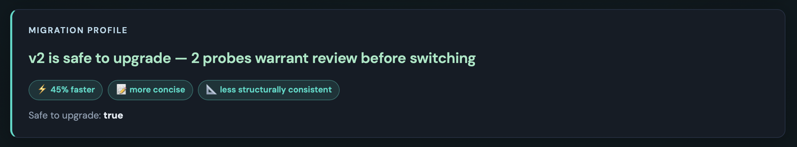

# ARSENIC 

ARSENIC detects behavioural drift between LLM versions before production upgrades.

Most eval frameworks tell you whether your model passed your tests.

ARSENIC tells you what changed about your model's behaviour whether you anticipated it or not.

For regressions it cannot automatically fix, it proposes validated prompt changes that can help recover the original behaviour.

You get a deprecation notice. Your model disappears in 90 days.

You upgrade. Tests pass.

Three weeks later:
- the support bot sounds different
- the sales assistant lost something
- the legal workflow hedges in ways that undermine confidence

Nothing broke.

It just changed.

And you had no way to see it coming.

Detect behavioural drift, classify regression severity, and generate validated prompt patches before deploying a model upgrade.




Licensed under Apache-2.0.

---

## What it does

ARSENIC runs a structured probe suite against two model endpoints in parallel and produces a behavioural drift report across seven dimensions:

- **Morphology** — did the response shape change? Length, structure, paragraph count, response type
- **Tone** — formality, assertiveness, hedging, contraction rate
- **Factual** — did known-answer probes regress?
- **Schema** — did structured JSON output stay valid and schema-compliant?
- **Instruction** — did the model continue following explicit instructions?
- **Refusal** — did refusal boundaries shift? Things answered that now aren't, or vice versa
- **Claim** — sentence-level cross-matching: does v2 convey the same information as v1, or did it drop claims, add new
  ones, or drift on specific values?

Every dimension gets a risk level (Green / Amber / Red) and a direction (Improvement / Regression / Neutral). The upgrade path section splits results into blocking regressions, improvements worth verifying, and neutral changes — so you know exactly what needs attention before you cut over.

**Latency** is measured per probe and summarised in a dedicated **Latency impact** report section (average baseline vs
target, delta, direction). It does not affect overall risk, probe direction, or upgrade path routing — timing is
observational, not a validation signal. Per-probe latency remains in the dimension snapshot table for drill-down.

The mutation engine goes one step further. For regressions it can address, it generates candidate prompt mutations, validates them against v2, and produces validated remediation candidates. You get the diff, a copy button, and confidence the fix actually works.

ARSENIC does not attempt to determine whether models are fundamentally equivalent systems or preserve any notion of identity continuity.

It measures operational behavioural drift and migration risk when substituting models in real workflows.


## Quickstart

Install from source:

```bash
cargo install --git https://github.com/markndg/arsenic
```

This puts `arsenic` on your `PATH` (in `~/.cargo/bin`). Or clone and build locally:

```bash
cargo build --release
```

List the standard probe suite:

```bash
arsenic probe list
```

Compare two models (OpenAI):

```bash
export OPENAI_API_KEY=sk-...

./target/release/arsenic compare \
  --v1 "openai:gpt-4o-mini" \
  --v2 "openai:gpt-4.1-mini" \
  --v1-key-env OPENAI_API_KEY \
  --v2-key-env OPENAI_API_KEY \
  --standard-suite full \
  --consistency-runs 3 \
  --mutate \
  --output ./report.html \
  --json ./report.json
```

Compare local models via Ollama:

```bash
export OLLAMA_KEY=ollama

./target/release/arsenic compare \
  --v1 "openai:llama3.1:8b" \
  --v2 "openai:llama3.2:3b" \
  --v1-endpoint "http://localhost:11434/v1" \
  --v2-endpoint "http://localhost:11434/v1" \
  --v1-key-env OLLAMA_KEY \
  --v2-key-env OLLAMA_KEY \
  --standard-suite full \
  --consistency-runs 3 \
  --mutate \
  --timeout-secs 120 \
  --output ./report.html \
  --json ./report.json
```

The report is a self-contained HTML file. Open it in a browser. Share it with whoever needs to make the upgrade
decision.

---

## Baseline snapshots

Capture a model's responses once, replay them against every future challenger without paying the API again.

```bash
export OPENAI_API_KEY=sk-...

arsenic baseline create \
  --name prod-2026-q2 \
  --model "openai:gpt-4o-mini" \
  --key-env OPENAI_API_KEY \
  --standard-suite full \
  --consistency-runs 3 \
  --notes "Production baseline — locked at quarter end"
```

Baselines are written to `.arsenic/baselines/<name>/` next to your project (override with `--cache-dir`).

### What invalidates a cached response

The rule:

> **Changing analysis expectations re-analyses cached outputs. Changing prompts, model, or runtime settings invalidates cached outputs.**

Concretely, the cache key hashes:

| Hashed (changing these invalidates the cache) | Not hashed (changing these re-analyses cached outputs) |
|---|---|
| Adapter type (openai / anthropic / google) | `tags` |
| Endpoint URL | `known_answer` |
| Model id | `refusal_expectation` |
| Temperature, max tokens | `expected_verbosity`, `expected_tone` |
| System prompt | `mutation_hint` |
| User prompt | `custom_assertions` |
| `expected_schema` (sent to the model) | `instructions` (rubric checks like `MaxWords`, `MustNotContain`) |

This is deliberate. The model never sees `known_answer`, `custom_assertions`, or the instruction rubric — those drive scoring after the response comes back. Editing them re-grades the existing baseline against new rules, which is what you usually want. Editing the prompt or model is a different question being asked of a different system and gets a fresh API call.

If you'd rather force a re-capture (for example, you suspect the model changed under a fixed alias like `gpt-4o-mini`), delete the baseline (`arsenic baseline remove`) and re-create it, or use cache-warming mode (pass both `--baseline NAME` and a live `--v1` spec).

Replay the baseline as v1 in any future comparison:

```bash
arsenic compare \
  --baseline prod-2026-q2 \
  --v2 "openai:gpt-4.1-mini" \
  --v2-key-env OPENAI_API_KEY \
  --standard-suite full \
  --output ./report.html
```

Cache-warming: pass both `--baseline NAME` and a live `--v1` spec to top up the baseline with any probes the cache is missing — already-captured probes stay untouched (rest of the suite hits the API once and is appended to the cache).

Two baselines compared against each other — fully offline, zero API calls:

```bash
arsenic compare \
  --baseline prod-2026-q2 \
  --baseline-target prod-2026-q4 \
  --output ./quarterly-drift.html
```

Manage baselines:

```bash
arsenic baseline list
arsenic baseline show prod-2026-q2
arsenic baseline verify prod-2026-q2        # re-hashes every cached file
arsenic baseline freeze prod-2026-q2        # rejects future writes
arsenic baseline diff prod-2026-q2 prod-2026-q4
arsenic baseline timeline --model gpt-4o-mini
```

`baseline verify` re-hashes every cached file and confirms the on-disk SHA matches the recorded `key_hash` and the filename — surfacing corruption or tampering. `freeze` is for end-of-quarter golden masters and CI pinning.

---

## CI integration

Gate model upgrades on pull requests with the [`markndg/arsenic-action`](https://github.com/markndg/arsenic-action) GitHub Action:

```yaml
name: AI Regression Check
on: [pull_request]

jobs:
  arsenic:
    runs-on: ubuntu-latest
    steps:
      - uses: actions/checkout@v4
      - uses: markndg/arsenic-action@v1
        with:
          old-model: gpt-4.1-mini
          new-model: gpt-5-mini
          corpus: ./prompts
          fail-on-risk: high
        env:
          OPENAI_API_KEY: ${{ secrets.OPENAI_API_KEY }}
```

A copyable workflow and a longer recipe — installing the binary directly, replaying a `--baseline`, uploading HTML/JSON reports as artefacts — are in [`examples/ci/`](examples/ci/).

---

## Why it matters

Your support bot runs on GPT-4o-mini. OpenAI deprecates it.
You upgrade to GPT-4.1-mini. Your tests pass.

Three weeks later: the bot sounds different. Responses are shorter.
A legal disclaimer stopped appearing. The JSON shape changed on one endpoint.
Nobody noticed until a customer complained.

ARSENIC catches this before you deploy.
Run it against your production prompts before deploying a model upgrade.
Get a migration report your team can act on.

---

## Example reports

Prebuilt reports — open directly in a browser, no build required.

**gpt-4o-mini → gpt-4.1-mini**

| Report | Probes | Result |
|--------|--------|--------|
| [Standard suite](https://markndg.github.io/arsenic/examples/gpt-4o-mini_vs_gpt-4_1-mini.html) | 18 | ⚠️ Safe — 3 probe warrants review |
| [Reasoning chains](https://markndg.github.io/arsenic/examples/gpt-4o-mini_vs_gpt-4_1-mini_reasoning.html) | 10 | 🔴 **Not safe** — 3 critical regressions |
| [Sycophancy](https://markndg.github.io/arsenic/examples/gpt-4o-mini_vs_gpt-4_1-mini_sycophancy.html) | 10 | ⚠️ Safe — 1 probe warrants review |
| [JSON schema](https://markndg.github.io/arsenic/examples/gpt-4o-mini_vs_gpt-4_1-mini_json_schema.html) | 10 | ⚠️ Safe — 2 probes warrant review |
| [Code generation](https://markndg.github.io/arsenic/examples/gpt-4o-mini_vs_gpt-4_1-mini_code_generation.html) | 10 | ✅ Safe — 10/10 green |
| [AI Assesment](https://markndg.github.io/arsenic/examples/gpt-4o-mini_vs_gpt-4_1-mini_ai_assessment.html) | 18 | 🔴 **Not safe** — 3 critical regressions |

**llama3.1:8b → llama3.2:3b (local Ollama)**

| Report | Probes | Result |
|--------|--------|--------|
| [Standard suite](https://markndg.github.io/arsenic/examples/llama3_1-8b_vs_llama3_2-3b.html) | 18 | 🔴 **Not safe** — 1 critical regression |

---

## Model support

ARSENIC is model-agnostic. Any OpenAI-compatible endpoint works out of the box — OpenAI, Ollama, vLLM, LM Studio,
Groq. Anthropic and Google have native adapters.

```bash
# Anthropic
./target/release/arsenic compare \
  --v1 "anthropic:claude-3-haiku-20240307" \
  --v2 "anthropic:claude-3-5-haiku-20241022" \
  --v1-key-env ANTHROPIC_API_KEY \
  --v2-key-env ANTHROPIC_API_KEY \
  --standard-suite full \
  --mutate \
  --output ./report.html

# Google
./target/release/arsenic compare \
  --v1 "google:gemini-1.5-flash" \
  --v2 "google:gemini-2.0-flash" \
  --v1-key-env GOOGLE_API_KEY \
  --v2-key-env GOOGLE_API_KEY \
  --standard-suite full \
  --output ./report.html
```

---

## Probe suite

The standard suite ships with 18 probes in the starter suite — the real value is importing your production prompts
alongside it across 7 categories covering factual accuracy, schema compliance, instruction following, refusal
boundaries, tone, morphology, and open-ended semantic consistency.

Bring your own production prompts alongside the standard suite:

```bash
./target/release/arsenic compare \
  --v1 "openai:gpt-4o-mini" \
  --v2 "openai:gpt-4.1-mini" \
  --v1-key-env OPENAI_API_KEY \
  --v2-key-env OPENAI_API_KEY \
  --standard-suite full \
  --user-corpus ./my-prompts/ \
  --mutate \
  --output ./report.html
```

User corpus probes are TOML files in the same format as the standard suite. You can annotate them with expected
behaviour to make valence scoring more precise:

```toml
[[probes]]
name = "support_greeting"
category = "Tone"
prompt = "Hi, I'm having trouble with my order."
expected_verbosity = "Moderate"
expected_tone = "Formal"
refusal_expectation = "ShouldAnswer"
mutation_hint = "If tone regresses, add: respond in a warm, professional tone."
tags = ["support", "tone", "production"]
```

Validate a corpus before running:

```bash
./target/release/arsenic probe validate ./my-prompts/
```

---

## Claim cross-matching

The claim dimension is where ARSENIC differs from a standard eval framework.

Whole-response similarity scores miss the things that actually matter. Two responses can look similar in embedding
space but one says "the rate is 4.5%" and the other says "the rate varies." Two responses can use completely different
phrasing and convey identical information. Cosine similarity on the full response can't tell these apart.

ARSENIC extracts informationally significant sentences from each response, strips scaffolding ("Great question!", "I
hope this helps", "In conclusion"), identifies claim anchors — numeric values, dates, named entities — and
cross-matches claims between v1 and v2 at the sentence level. Dropped claims, new claims, and anchor drift (where a
specific value changes between versions) are surfaced separately.

A probe that drops "the interest rate is 4.5%" and replaces it with "interest rates vary" is a different finding from
one that says the same thing in a longer sentence. The claim dimension catches the first. Cosine similarity doesn't.

---

## Mutation engine

Run with `--mutate` to enable the prompt mutation engine.

For each blocking regression, ARSENIC generates a candidate prompt mutation, runs it against v2, and checks whether
the risk improves. Strategies are rule-based and drift-informed — if v2 dropped specific claim anchors, the mutation
adds an explicit instruction to cover them. If v2 became more verbose, it adds a length constraint. If v2 over-hedged,
it adds a directness instruction.

Mutations that validate are auto-validated — the report shows the original prompt, the mutated prompt, and a copy
button. Mutations that don't validate after three strategy attempts are marked for manual review.

The engine is deterministic. No LLM is used to generate mutations. The validated prompt patch is something you can put in
a test and trust.

---

## Consistency scoring

By default ARSENIC runs each probe 3 times per model (`--consistency-runs 3`). Variance across runs is measured and
reported as a separate dimension.

A model that gives inconsistent answers on repeated identical prompts is a different problem from one that gives
consistently different answers. The consistency dimension surfaces both — a v2 that's more variable than v1 is flagged as
a regression even if each individual response looks acceptable.

Use `--consistency-runs 1` to match v1 behaviour and halve your API spend.

---

## Flags

| Flag | Default | Description |
|------|---------|-------------|
| `--standard-suite` | — | Probe categories to run: `full`, `factual`, `tone`, `morphology`, `schema`, `instruction`, `refusal`, `semantic`. Comma-separate multiple. |
| `--user-corpus` | — | Path to directory of user-defined probe TOML files (appended to the standard suite by default) |
| `--user-corpus-only` | off | Run only `--user-corpus` probes; skip the standard suite (requires `--user-corpus`) |
| `--consistency-runs` | `3` | Runs per probe per model for consistency scoring |
| `--mutate` | off | Run the prompt mutation engine after comparison |
| `--no-semantic` | off | Disable semantic similarity dimension |
| `--concurrency` | `10` | Max parallel requests per endpoint |
| `--timeout-secs` | `30` | Request timeout — increase for slow local models |
| `--output` | — | HTML report output path |
| `--json` | — | JSON report output path |
| `--config` | — | Path to `arsenic.toml` config file |

---

## Config file

```toml
[v1]
adapter = "openai"
api_key_env = "OPENAI_API_KEY"
model_id = "gpt-4o-mini"
temperature = 0.0

[v2]
adapter = "openai"
api_key_env = "OPENAI_API_KEY"
model_id = "gpt-4.1-mini"
temperature = 0.0

[run]
consistency_runs = 3
timeout_secs = 60
standard_suite = "full"
user_corpus = "./my-prompts/"

[output]
html = "./reports/latest.html"
json = "./reports/latest.json"
```

```bash
./target/release/arsenic compare --config arsenic.toml
```

---

## Reconcile (single prompt)

`reconcile` is the inverse of `compare --mutate`. You supply one prompt you care about; ARSENIC analyses the behavioural
gap between a baseline and target model response, ranks drift signals by magnitude, and tries cumulative prompt
mutations until overall risk improves or the attempt budget is exhausted. Output is a compact HTML/JSON report with a
**validated prompt patch** (when validation succeeds) or a **needs attention** flag (when the gap is too large to close
with instructions alone).

That second outcome is valid: you cannot always prompt-engineer a smaller model into matching a larger one on a complex
open-ended question. Reconcile tells you when it worked and when it did not.

### Input modes

| Mode | How baseline response is supplied | Target endpoint |
|------|-----------------------------------|-----------------|
| **1 — Generate** | `--v1` + `--v1-endpoint` + `--v1-key-env` (both models called) | Required (`--v2`, `--v2-endpoint`, `--v2-key-env`) |
| **2 — Files** | `--v1-response` (and optionally `--v2-response`) | Required for validation |
| **3 — Inline** | `--v1-response-inline` + `--v2-response-inline` | Required for validation |

`--prompt` (or `--prompt-file`) is always required. Modes cannot be mixed (e.g. inline flags with `--v1`).

```bash
# Mode 1 — generate both responses, validate against target
./target/release/arsenic reconcile \
  --prompt "Explain what APIs are to a junior developer" \
  --v1 "openai:llama3.1:8b" --v2 "openai:llama3.2:3b" \
  --v1-endpoint "http://localhost:11434/v1" --v2-endpoint "http://localhost:11434/v1" \
  --v1-key-env OLLAMA_KEY --v2-key-env OLLAMA_KEY \
  --max-strategies 5 \
  --output ./reconcile.html --json ./reconcile.json

# Mode 2 — baseline from production log; target response from file or live call
./target/release/arsenic reconcile \
  --prompt "Explain what APIs are to a junior developer" \
  --v1-response ./baseline_output.txt \
  --v2-response ./target_output.txt \
  --v2 "openai:llama3.2:3b" \
  --v2-endpoint "http://localhost:11434/v1" \
  --v2-key-env OLLAMA_KEY \
  --output ./reconcile.html

# Mode 3 — inline responses (scripting / CI); target endpoint still used for validation
./target/release/arsenic reconcile \
  --prompt "What is the capital of France?" \
  --v1-response-inline "Paris is the capital of France." \
  --v2-response-inline "The capital city of France is Paris." \
  --v2 "openai:llama3.2:3b" \
  --v2-endpoint "http://localhost:11434/v1" \
  --v2-key-env OLLAMA_KEY
```

Use Mode 2 when you already have a baseline reply from real traffic and only need to find the prompt fix against the new
model. A truncated or partial target file in Mode 2 will inflate claim and semantic drift versus Mode 1 with the full
live response — the engine will work harder and may correctly end in needs attention.

### How mutations are chosen

Unlike `compare --mutate`, which applies strategies in a fixed order, reconcile **ranks signals by magnitude** (anchor
drift and factual regression first, then schema, morphology, tone, semantic drift) and maps each signal to one or more
strategies. Large anchor lists are split into chunks so each attempt adds the next cumulative prefix. Identical
strategies never appear twice in the sequence.

Long-form semantic probes with many dropped claims get **topic coverage** instructions (from `**bold headings**` in the
baseline, capped at six topics) rather than a wall of required values. Shorter gaps use value-inclusion instructions.

Validation runs up to `--max-strategies` attempts (default **5**). Each attempt fires the mutated prompt at the target
endpoint and re-scores against the baseline response. The loop stops early on the first improvement (Red→Amber,
Red→Green, or Amber→Green); otherwise all attempts are recorded and needs attention is recommended.

### Useful flags

| Flag | Default | Purpose |
|------|---------|---------|
| `--max-strategies` | `5` | Cumulative mutation attempts |
| `--timeout-secs` | `30` | API timeout per validation call |
| `--no-semantic` | off | Disable semantic similarity dimension |
| `--system-prompt` / `--system-prompt-file` | — | Shared system prompt for generation |

---

## Commands

```
arsenic compare                    Run probe suite, write reports
arsenic reconcile                  Single-prompt drift fix (see above)
arsenic probe list                 List standard probes
arsenic probe list --category tone Filter by category
arsenic probe show <name>          Show one probe as JSON
arsenic probe validate <path>      Validate user corpus TOML
arsenic report render <json>       Re-render a saved JSON report
arsenic report summary <json>      Print summary to stdout
arsenic models download <name>     Download HuggingFace model weights
```

---

## Environment variables

| Variable | Purpose |
|----------|---------|
| `OPENAI_API_KEY` | OpenAI API key |
| `ANTHROPIC_API_KEY` | Anthropic API key |
| `GOOGLE_API_KEY` | Google API key |
| `OLLAMA_KEY` | Any non-empty string for Ollama (not validated) |
| `ARSENIC_LOG` | Log level: `error`, `warn`, `info`, `debug` |
| `ARSENIC_SUITE_PATH` | Override default probe suite directory |

---

## Workspace

```
crates/
  arsenic-core/       Types, comparison engine, claim matching, mutation engine
  arsenic-probes/     TOML probe loader
  arsenic-adapters/   OpenAI-compatible, Anthropic, Google adapters
  arsenic-report/     HTML / JSON / Markdown report rendering
  arsenic/            arsenic binary
probe-suite/standard/ Standard probe suite (18 probes, 7 categories)
report-templates/     Tera templates
examples/             Prebuilt HTML drift reports (open in a browser)
```

Built in Rust. Fast. No runtime dependencies. The report is a single self-contained HTML file with no external CDN
calls after the font load.

---

## Licence

Apache 2.0
