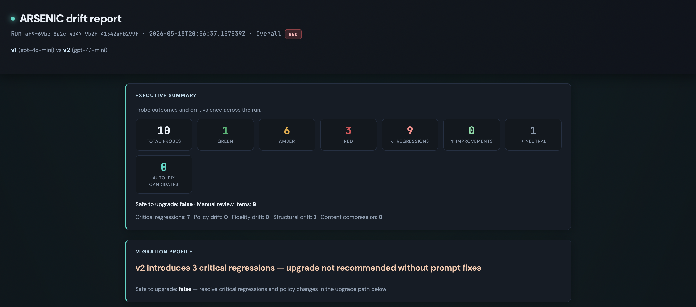
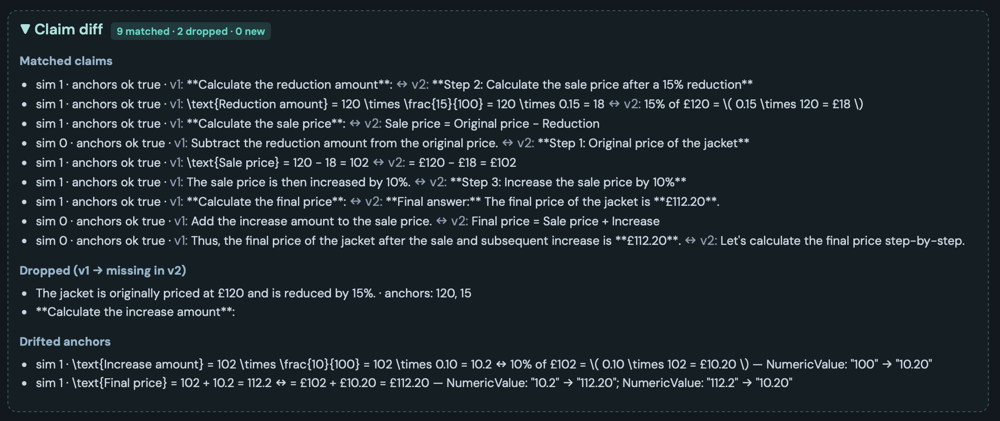

# ARSENIC 

> Using Arsenic? Drop a note — I read everything: [open a blank issue titled "Using this"](https://github.com/markndg/arsenic/issues/new)

You upgraded the model. Your tests passed.

Three weeks later the support bot sounds different. Responses are shorter. A legal
disclaimer stopped appearing. The JSON shape changed on one endpoint. Nobody noticed
until a customer complained.

**Arsenic catches this before you deploy.**

---

<

---

## What Arsenic found on real model upgrades

| Comparison | Probe pack | Probes | Result |
|------------|------------|--------|--------|
| gpt-4o-mini → gpt-4.1-mini | Reasoning chains | 10 | 🔴 3 critical regressions |
| gpt-4o-mini → gpt-4.1-mini | Code generation | 10 | ✅ 10/10 green |
| gpt-4o-mini → gpt-4.1-mini | JSON schema | 10 | ⚠️ 2 probes warrant review |
| gpt-4o-mini → gpt-4.1-mini | Sycophancy | 10 | ⚠️ 1 probe warrants review |
| gpt-4o-mini → gpt-4.1-mini | Standard suite | 18 | ⚠️ 3 probes warrant review |
| llama3.1:8b → llama3.2:3b | Standard suite | 18 | 🔴 1 critical regression |

**The code generation upgrade is safe. The reasoning upgrade is not.**
That distinction is invisible to standard test suites. Arsenic surfaces it before you cut over.

Open the prebuilt reports in your browser — no install required:
- [GPT-4o-mini → GPT-4.1-mini](https://markndg.github.io/arsenic/examples/gpt-4o-mini_vs_gpt-4_1-mini.html)
- [Llama 3.1:8b → Llama 3.2:3b](https://markndg.github.io/arsenic/examples/llama3_1-8b_vs_llama3_2-3b.html)

---

## Quickstart

### Download a pre-built binary

| Platform | File |
|----------|------|
| Linux x86_64 | `arsenic-linux-x86_64.tar.gz` |
| macOS Apple Silicon | `arsenic-macos-aarch64.tar.gz` |
| macOS Intel | `arsenic-macos-x86_64.tar.gz` |
| Windows | `arsenic-windows-x86_64.zip` |

Grab the latest from the [Releases page](https://github.com/markndg/arsenic/releases).

> **macOS note:** Right-click the binary → Open → Open Anyway. Required once due to Gatekeeper.
> Or: `xattr -dr com.apple.quarantine ./arsenic`

### Install from source

```bash
cargo install --git https://github.com/markndg/arsenic
```

### Run your first comparison

```bash
export OPENAI_API_KEY=sk-...

arsenic compare \
  --v1 "openai:gpt-4o-mini" \
  --v2 "openai:gpt-4.1-mini" \
  --v1-key-env OPENAI_API_KEY \
  --v2-key-env OPENAI_API_KEY \
  --standard-suite full \
  --consistency-runs 3 \
  --mutate \
  --output ./report.html \
  --json ./report.json
```

The report is a self-contained HTML file. Open it in a browser. Share it with whoever
needs to make the upgrade decision.

**Local models via Ollama:**

```bash
export OLLAMA_KEY=ollama

arsenic compare \
  --v1 "openai:llama3.1:8b" \
  --v2 "openai:llama3.2:3b" \
  --v1-endpoint "http://localhost:11434/v1" \
  --v2-endpoint "http://localhost:11434/v1" \
  --v1-key-env OLLAMA_KEY \
  --v2-key-env OLLAMA_KEY \
  --standard-suite full \
  --consistency-runs 3 \
  --mutate \
  --timeout-secs 120 \
  --output ./report.html \
  --json ./report.json
```

---

## What it does

Most eval frameworks test whether your model passed your tests.
Arsenic tests what changed about your model's behaviour whether you anticipated it or not.

It runs a structured probe suite against two model endpoints in parallel and produces a
drift report across seven dimensions:

- **Morphology** — did the response shape change? Length, structure, paragraph count
- **Tone** — formality, assertiveness, hedging, contraction rate
- **Factual** — did known-answer probes regress?
- **Schema** — did structured JSON output stay valid and schema-compliant?
- **Instruction** — did the model continue following explicit instructions?
- **Refusal** — did refusal boundaries shift?
- **Claim** — sentence-level cross-matching: does v2 say the same thing as v1?

Every dimension gets a risk level (Green / Amber / Red) and a direction (Improvement /
Regression / Neutral). The upgrade path section tells you exactly what needs attention
before you cut over.

---

## Why claim cross-matching matters

Cosine similarity on a full response misses what actually matters.

Two responses can look similar in embedding space but one says "the rate is 4.5%" and
the other says "the rate varies." Arsenic extracts informationally significant sentences,
strips scaffolding, identifies claim anchors — numeric values, dates, named entities —
and cross-matches them between v1 and v2 at sentence level.

A probe that drops "the interest rate is 4.5%" and replaces it with "interest rates vary"
is a regression. Cosine similarity doesn't catch it. Arsenic does.



---

## Mutation engine

Run with `--mutate` to automatically generate and validate prompt fixes for regressions.

For each blocking regression, Arsenic generates a candidate prompt mutation, runs it
against v2, and checks whether the risk improves. Strategies are rule-based and
drift-informed — if v2 dropped specific claim anchors, the mutation adds an explicit
instruction to cover them. If v2 became more verbose, it adds a length constraint.

The engine is deterministic. No LLM is used to generate mutations. The validated prompt
patch is something you can put in a test and trust.

Mutations that validate show the original prompt, the mutated prompt, and a copy button.
Mutations that don't validate after three attempts are marked for manual review — because
you cannot always prompt-engineer a smaller model into matching a larger one, and Arsenic
tells you when it worked and when it did not.

---

## Model support

Any OpenAI-compatible endpoint works out of the box — OpenAI, Ollama, vLLM, LM Studio,
Groq. Anthropic and Google have native adapters.

```bash
# Anthropic
arsenic compare \
  --v1 "anthropic:claude-3-haiku-20240307" \
  --v2 "anthropic:claude-3-5-haiku-20241022" \
  --v1-key-env ANTHROPIC_API_KEY \
  --v2-key-env ANTHROPIC_API_KEY \
  --standard-suite full \
  --mutate \
  --output ./report.html

# Google
arsenic compare \
  --v1 "google:gemini-1.5-flash" \
  --v2 "google:gemini-2.0-flash" \
  --v1-key-env GOOGLE_API_KEY \
  --v2-key-env GOOGLE_API_KEY \
  --standard-suite full \
  --output ./report.html
```

---

## Bring your own prompts

The real value is running Arsenic against your production prompts, not just the standard
suite. Add a `--user-corpus` directory of TOML probe files alongside the standard suite:

```bash
arsenic compare \
  --v1 "openai:gpt-4o-mini" \
  --v2 "openai:gpt-4.1-mini" \
  --v1-key-env OPENAI_API_KEY \
  --v2-key-env OPENAI_API_KEY \
  --standard-suite full \
  --user-corpus ./my-prompts/ \
  --mutate \
  --output ./report.html
```

```toml
# my-prompts/support_greeting.toml
[[probes]]
name = "support_greeting"
category = "Tone"
prompt = "Hi, I'm having trouble with my order."
expected_verbosity = "Moderate"
expected_tone = "Formal"
refusal_expectation = "ShouldAnswer"
mutation_hint = "If tone regresses, add: respond in a warm, professional tone."
tags = ["support", "tone", "production"]
```

Validate a corpus before running:

```bash
arsenic probe validate ./my-prompts/
```

---

## Reconcile: fix one prompt

`reconcile` is the single-prompt version of the mutation engine. Supply one prompt you
care about — Arsenic finds the behavioural gap between v1 and v2 and generates a
validated prompt patch.

```bash
arsenic reconcile \
  --prompt "Explain what APIs are to a junior developer" \
  --v1 "openai:gpt-4o-mini" \
  --v2 "openai:gpt-4.1-mini" \
  --v1-key-env OPENAI_API_KEY \
  --v2-key-env OPENAI_API_KEY \
  --max-strategies 5 \
  --output ./reconcile.html
```

---

## Flags

| Flag | Default | Description |
|------|---------|-------------|
| `--standard-suite` | — | `full`, `factual`, `tone`, `morphology`, `schema`, `instruction`, `refusal`, `semantic` |
| `--user-corpus` | — | Directory of user-defined probe TOML files |
| `--consistency-runs` | `3` | Runs per probe per model |
| `--mutate` | off | Run the prompt mutation engine |
| `--no-semantic` | off | Disable semantic similarity dimension |
| `--concurrency` | `10` | Max parallel requests per endpoint |
| `--timeout-secs` | `30` | Request timeout |
| `--output` | — | HTML report path |
| `--json` | — | JSON report path |
| `--config` | — | Path to `arsenic.toml` config file |

---

## Commands

```
arsenic compare                    Run probe suite, write reports
arsenic reconcile                  Single-prompt drift fix
arsenic probe list                 List standard probes
arsenic probe list --category tone Filter by category
arsenic probe show <name>          Show one probe as JSON
arsenic probe validate <path>      Validate user corpus TOML
arsenic report render <json>       Re-render a saved JSON report
arsenic report summary <json>      Print summary to stdout
```

---

## Built in Rust

Fast. No runtime dependencies. The report is a single self-contained HTML file with no
external CDN calls after the font load.

```
crates/
  arsenic-core/       Comparison engine, claim matching, mutation engine
  arsenic-probes/     TOML probe loader
  arsenic-adapters/   OpenAI-compatible, Anthropic, Google adapters
  arsenic-report/     HTML / JSON report rendering
  arsenic-cli/        arsenic binary
probe-suite/standard/ Standard probe suite (18 probes, 7 categories)
examples/             Prebuilt HTML drift reports
```

---

## Licence

Apache 2.0